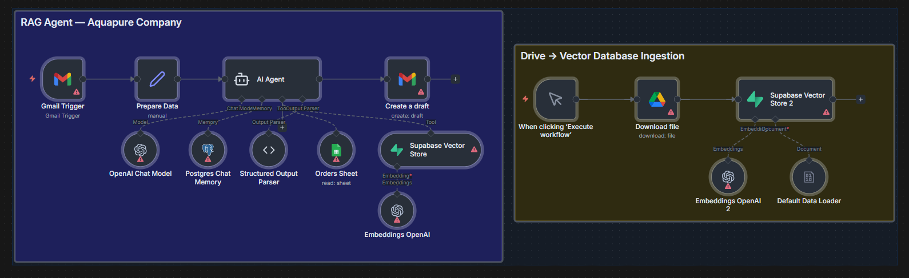

# n8n Workflows Portfolio

<p align="center">
  
  <br/>
  <em>Customer Support RAG Agent — Gmail polling, vector retrieval, order lookup, and drafted reply, orchestrated in n8n.</em>
</p>

<p align="center">
  
  
  
  
  
  
</p>

> Production-grade n8n automations across **AI agents, RAG, multi-modal generation, and operational tooling**. Each workflow is self-contained — drop the JSON into your n8n instance, set credentials, and it runs.

---

## At a glance

|  | Workflow | What it does | Primary stack |
|---|---|---|---|
| 🖼️ | [E-commerce Ad Creation Agent](ecommerce-ad-creation-agent/) | Product photo → polished ad image **or** 8-second UGC video | GPT-4o Vision · Gemini Nano Banana Pro · Veo 3.1 Fast |
| 📧 | [Customer Support RAG Agent](customer-support-rag-agent/) | Inbound Gmail → answers from vector KB **and** order lookup → drafted reply | LangChain Agent · Supabase pgvector · Postgres memory · Sheets tool |
| 📞 | [Hotel Voice Agent](hotel-voice-agent/) | ElevenLabs voice call → answers, books rooms, emails confirmation | gpt-5-mini · Reasoning Tool · Calendar · Gmail · Supabase KB |
| 📰 | [AI Newsletter Automation](ai-newsletter-automation/) | 6 RSS feeds → AI-only filter → daily HTML digest at 22:00 | Schedule · 6× RSS · gpt-4.1-mini · Gmail |
| 🛒 | [Dropshipping Product Researcher](dropshipping-product-researcher/) | Keyword → Amazon scrape → top-5 → TikTok validation → Sheets winners | Apify · 2× LangChain Agents · Loop · Sheets dashboard |
| 📑 | [Retail Catalog Analyzer](retail-catalog-analyzer/) | Promo PDF → vision extraction → top-5 resale picks scored 0–10 | CloudConvert · GPT-4o Vision · gpt-5-mini · Sheets |
| 🧾 | [Telegram Invoice Generator](telegram-invoice-generator/) | Telegram text/voice → AI invoice JSON → branded PDF → reply with link | Telegram · Whisper · Calculator · APITemplate.io |
| 💼 | [LinkedIn Job Scraper](linkedin-job-scraper/) | Web form → Apify LinkedIn → location filter → styled HTML email digest | Form · Apify · SMTP · Sheets tracking |
| 💬 | [WhatsApp AI Assistant](whatsapp-ai-assistant/) | Text → instant AI reply · Voice note → STT → AI → TTS audio reply | WhatsApp Business Cloud · gpt-4.1-nano · Whisper · TTS |

---

## Patterns demonstrated

- **Retrieval-Augmented Generation (RAG)** with Supabase `pgvector` and OpenAI embeddings — see [customer-support-rag-agent](customer-support-rag-agent/) and [hotel-voice-agent](hotel-voice-agent/).
- **Multi-modal generation** — vision-grounded prompt synthesis driving image (Nano Banana Pro) and video (Veo 3.1 Fast) generators in [ecommerce-ad-creation-agent](ecommerce-ad-creation-agent/).
- **Voice-first interfaces** — STT → LLM → TTS pipelines exposed as a WhatsApp bot ([whatsapp-ai-assistant](whatsapp-ai-assistant/)) and an ElevenLabs phone agent ([hotel-voice-agent](hotel-voice-agent/)).
- **Multi-agent orchestration** — a *NEXUS* selector + *MARCUS* judge with per-item iteration and engagement-metric gating in [dropshipping-product-researcher](dropshipping-product-researcher/).
- **Vision-based data extraction** from PDFs and product photos using GPT-4o Vision, with structured YAML/JSON output parsers — [retail-catalog-analyzer](retail-catalog-analyzer/), [ecommerce-ad-creation-agent](ecommerce-ad-creation-agent/).
- **Multi-channel triggers** — Form, Webhook, Schedule, Gmail polling, Telegram, WhatsApp — picked per use case rather than reused by default.
- **Tool-using agents with strict structured output** — every agent that writes to Sheets, Gmail, or PDF templates is wrapped in an Output Parser to enforce a JSON contract.

---

## Tech stack

**LLMs & generation** — OpenAI GPT-4.1 (mini/nano), GPT-4o Vision, GPT-5-mini, GPT-5.4, Whisper, OpenAI TTS · Google Gemini (Nano Banana Pro, Veo 3.1 Fast) · ElevenLabs

**Data & RAG** — Supabase (pgvector) · Postgres · OpenAI Embeddings · LangChain Default Data Loader

**Messaging & comms** — Gmail · Telegram Bot API · WhatsApp Business Cloud · SMTP · ElevenLabs Webhook

**Productivity** — Google Sheets · Google Drive · Google Calendar

**Scraping & data sources** — Apify (Amazon, TikTok, LinkedIn) · RSS Feed Read · CloudConvert · APITemplate.io

**n8n core** — LangChain Agent · Output Parser · Tool nodes · Switch · Loop (Split In Batches) · Wait · Code (JS) · Schedule · Form · Webhook

---

## Importing a workflow

1. Open n8n → **Import from File**.
2. Upload `workflow.json` from the workflow's folder.
3. Configure the credentials listed in that workflow's README.
4. Replace any sample identifiers (Drive folder/file IDs, Sheets `documentId` / `sheetName`, Telegram `phoneNumberId`, etc.) with your own.
5. Activate.

Each workflow folder contains its own `README.md` with the full setup, credentials list and an architecture diagram.

---

## Repository layout

```
n8n-workflows/
├── README.md                              ← you are here
├── CLAUDE.md                              ← guidance for AI coding assistants
├── ecommerce-ad-creation-agent/
│   ├── workflow.json
│   ├── README.md
│   └── architecture.png
├── customer-support-rag-agent/
├── hotel-voice-agent/
├── ai-newsletter-automation/
├── dropshipping-product-researcher/
├── retail-catalog-analyzer/
├── telegram-invoice-generator/
├── linkedin-job-scraper/
└── whatsapp-ai-assistant/
```

---

## Author

**Rayan DJEBAR** — [github.com/djebar-rayan](https://github.com/djebar-rayan) · `djebar.rayan75@gmail.com`
