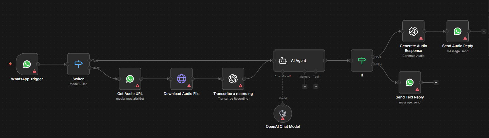

# AI Newsletter Automation

## Use Case
Generates a daily AI news digest by aggregating six leading RSS feeds (OpenAI, Google AI, Microsoft AI, MIT, Anthropic, and Meta Engineering), filtering for AI-related content, summarizing the highlights with GPT-4.1-mini, formatting the result as a styled HTML email, and dispatching it through Gmail every day at 22:00.

## Tools & Integrations
- Schedule Trigger (daily at 22:00)
- RSS Feed Read (six independent sources)
- OpenAI Chat (`gpt-4.1-mini`)
- Code nodes (article filtering + HTML email rendering)
- Merge / Set
- Gmail (send)

## Setup Instructions
1. In n8n, choose **Import from File** and upload `workflow.json` from this folder.
2. Configure credentials:
   - **OpenAI API** for the `OpenAI` summarization node.
   - **Gmail OAuth2** for the `Gmail` send node.
3. Update the recipient address on the `Gmail` node (replace `djebar.rayan75@gmail.com` with the desired distribution address).
4. Adjust the `Schedule Trigger` hour if a different send time is preferred.
5. Activate the workflow.

## Architecture

## Author
Rayan DJEBAR
