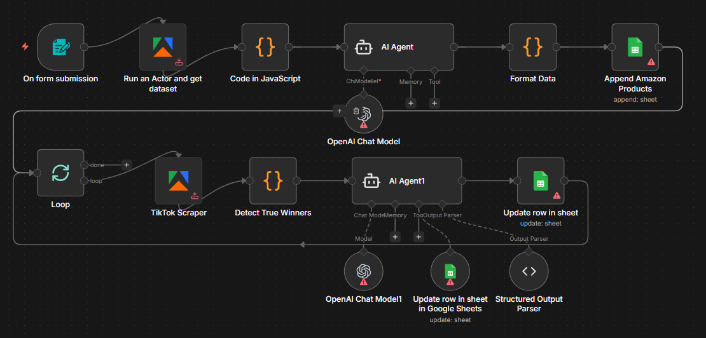

# Dropshipping Product Researcher

## Use Case
A multi-source product research pipeline that turns a single product keyword into a vetted shortlist of dropshipping winners. The user enters a search term, an Apify Amazon scraper pulls candidate products, the **NEXUS** AI agent ranks the top 5 against criteria for demand, video potential, margin, and quality, then for each winner an Apify TikTok scraper pulls recent videos, a JS code node computes engagement and intent rates, and the **Marcus** judgment-AI delivers a final true-winner verdict — all logged to a Google Sheets dashboard.

## Tools & Integrations
- Form Trigger
- Apify (Amazon scraper + TikTok scraper)
- Code nodes (raw text formatting + winner extraction + TikTok metrics computation)
- LangChain Agent on OpenAI `gpt-5.4` (NEXUS — initial top-5 selection)
- LangChain Agent on OpenAI `gpt-5.4-2026-03-05` (Marcus — verdict pass)
- Loop (`Split In Batches`) for per-product iteration
- Google Sheets (append + dual update flow with the `Update row in sheet` and `Update row in sheet in Google Sheets` nodes)
- Structured Output Parser (`winner` / `justification`)

## Setup Instructions
1. In n8n, choose **Import from File** and upload `workflow.json` from this folder.
2. Configure credentials: **Apify** (the two Apify nodes), **OpenAI API**, **Google Sheets OAuth2**.
3. Replace the spreadsheet `documentId` on the three Google Sheets nodes with your own *Product Winners* sheet. The sheet must keep its existing column headers (`asin`, `lien`, `titre_shopify`, `niche`, `mot_cle_tiktok`, plus the `TikTok - …` and `Tiktok - …` set, plus `Verdict` and `Justification`) — these column IDs are referenced verbatim by the workflow.
4. Pick the Apify Amazon and TikTok scraper actors on the two Apify nodes (the credentials and actor selection are intentionally cleared in this template).
5. Activate the workflow and submit a test product keyword through the public form URL.

## Architecture

## Author
Rayan DJEBAR
