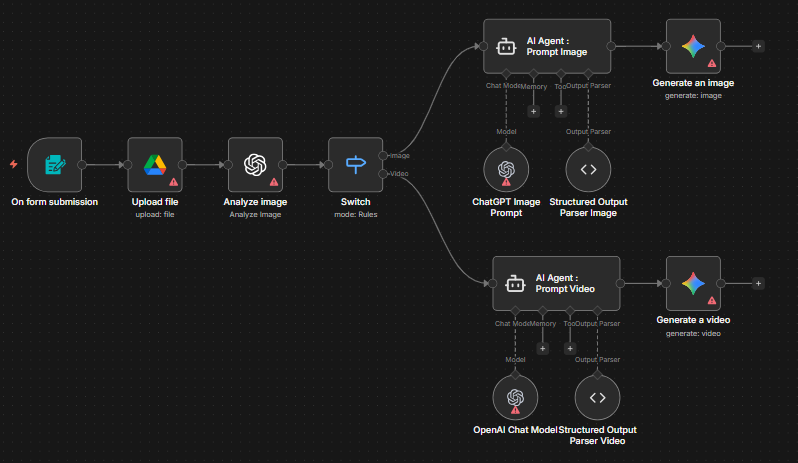

# E-commerce Ad Creation Agent

## Use Case
Turns a single product photo and a one-line marketing intent into a finished ad creative — either a polished commercial image or an 8-second UGC-style short video. The user uploads a product photo through a form, GPT-4o Vision extracts a precise YAML description (brand, palette, typography, materials), a specialised AI Agent crafts an optimised prompt, and Google Gemini generates the final asset (Nano Banana Pro for stills, Veo 3.1 Fast for video).

## Tools & Integrations
- Form Trigger (Description + Image upload + Image/Video radio)
- Google Drive (`Upload file`)
- OpenAI GPT-4o Vision (`Analyze image`) producing structured YAML
- Switch (Image vs. Video routing)
- LangChain Agent on OpenAI `gpt-4.1-mini` (`AI Agent : Prompt Image`)
- LangChain Agent on OpenAI `gpt-5.2-chat-latest` (`AI Agent : Prompt Video`)
- Structured Output Parsers (image_prompt / video_prompt)
- Google Gemini Image (`gemini-3-pro-image-preview` / Nano Banana Pro)
- Google Gemini Video (`veo-3.1-fast-generate-preview`)

## Setup Instructions
1. In n8n, choose **Import from File** and upload `workflow.json` from this folder.
2. Configure credentials: **OpenAI API**, **Google Drive OAuth2**, **Google Gemini (PaLM) API**.
3. Replace the Google Drive `folderId` on `Upload file` with a folder of your own (currently points to a sample `N8N` folder).
4. Activate the workflow and submit a product photo through the public form URL — pick **Image** for a static ad poster or **Video** for a UGC-style 9:16 short.

## Architecture

## Author
Rayan DJEBAR
