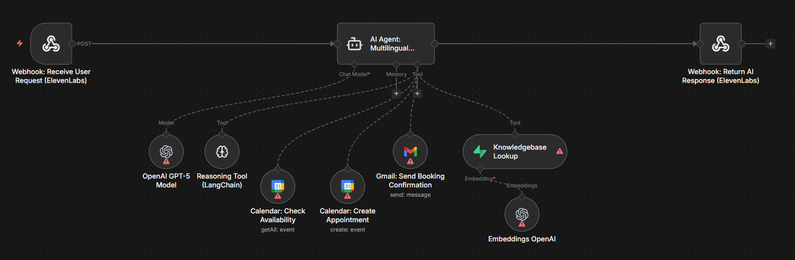

# Hotel Voice Agent

## Use Case
A backend agent that powers an ElevenLabs voice assistant for the fictional Hotel Luna Parisienne. It receives transcribed guest calls over a webhook, answers hotel questions from a Supabase vector knowledge base, checks room availability through Google Calendar, creates bookings, and dispatches a confirmation email — all returned to ElevenLabs as structured JSON for natural voice responses.

## Tools & Integrations
- Webhook (ElevenLabs inbound) + Respond to Webhook
- LangChain Agent on OpenAI `gpt-5-mini`
- LangChain Reasoning Tool (chain-of-thought planner)
- Supabase Vector Store (`hotel_luna` knowledge base) with OpenAI Embeddings
- Google Calendar Tool (availability check + booking creation)
- Gmail Tool (booking confirmation email)

## Setup Instructions
1. In n8n, choose **Import from File** and upload `workflow.json` from this folder.
2. Configure credentials:
   - **OpenAI API** for the chat model and embeddings.
   - **Supabase** for the `Knowledgebase Lookup` vector store (table `hotel_luna`).
   - **Google Calendar OAuth2** for the two Calendar tools.
   - **Gmail OAuth2** for the booking confirmation email tool.
3. Point the ElevenLabs voice agent at the webhook URL exposed by `Webhook: Receive User Request (ElevenLabs)`.
4. Activate the workflow before placing test calls.

## Architecture

## Author
Rayan DJEBAR
