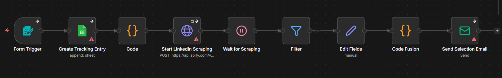

# LinkedIn Job Scraper

## Use Case
A job-hunting funnel that turns a single web form into a delivered shortlist. The candidate fills in title, location, contract type, and work schedule; the workflow logs the run to Google Sheets, converts the human-readable preferences to LinkedIn API codes, fires an Apify LinkedIn scraper, filters the results by location, normalises the fields, and emails the candidate a styled HTML digest with one card per opportunity.

## Tools & Integrations
- Form Trigger (job-search request form)
- Google Sheets (`Create Tracking Entry`)
- Code nodes (label-to-code mapping + HTML email composition)
- HTTP Request → Apify LinkedIn scraper actor
- Wait + Filter + Set (`Edit Fields`) for orchestration and normalisation
- Email Send (HTML digest delivery)

## Setup Instructions
1. In n8n, choose **Import from File** and upload `workflow.json` from this folder.
2. Configure credentials:
   - **HTTP Header Auth** for the Apify call (replace the inline `apify_api_…` token in `Start LinkedIn Scraping` with your own token, ideally moved into a credential).
   - **Google Sheets OAuth2** for the tracking sheet.
   - **SMTP** for the `Send Selection Email` node (set the `fromEmail` to your sender address).
3. Replace the spreadsheet `documentId` and `sheetName` on `Create Tracking Entry` with your own tracking sheet (existing column IDs `userLastName`, `userFirstName`, `userEmail`, `jobTitleQuery`, `locationQueryCity`, `locationQueryCountry`, `JobType`, `WorkSchedule`, `submissionTimestamp`, `runId` must exist).
4. Adjust the `Filter` node's location string if you want to narrow to a different region (currently `"Île-de-France, France"`).
5. Activate the workflow and submit a test query through the public form URL.

## Architecture

## Author
Rayan DJEBAR
