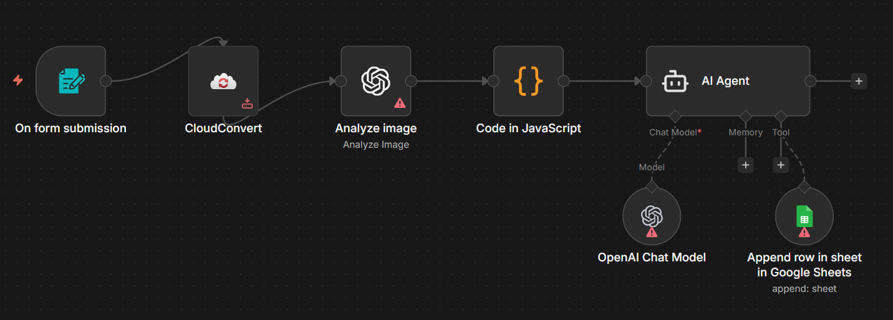

# Retail Catalog Analyzer

## Use Case
Turns a promotional retail catalog PDF into ranked, ready-to-action resale opportunities. Uploaded catalogs are converted to images by CloudConvert, processed by GPT-4o vision to extract every non-food product (name, reference, old/new price, promo type, specs), then a JS code node computes savings and discount percentages. A LangChain AI Agent picks the top 5 resale candidates, scores them out of 10, and writes them straight to Google Sheets.

## Tools & Integrations
- Form Trigger (PDF upload)
- CloudConvert (PDF → image)
- OpenAI GPT-4o Vision (`Analyze image`)
- Code node (JavaScript discount and percentage calculations)
- LangChain Agent on OpenAI `gpt-5-mini`
- Google Sheets Tool (append the Top 5)

## Setup Instructions
1. In n8n, choose **Import from File** and upload `workflow.json` from this folder.
2. Configure credentials:
   - **CloudConvert** for the PDF-to-image conversion.
   - **OpenAI API** for the chat model and the vision-analysis node.
   - **Google Sheets OAuth2** for the `Append row in sheet in Google Sheets` tool.
3. Replace the spreadsheet `documentId` and `sheetName` on the Google Sheets node with your own catalog tracking sheet (the existing column headers — `Nom du Produit`, `Prix Promo`, `Economie`, `Réduction (%)`, `Note sur 10`, `Justification`, `Référence` — are referenced by the AI tool mapping; rename them in lockstep on both sides if you change them).
4. Activate the workflow and submit a catalog PDF through the public form URL.

## Architecture

## Author
Rayan DJEBAR
