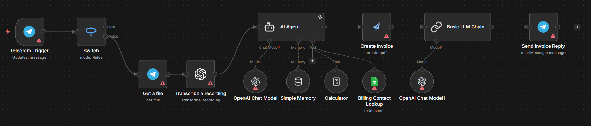

# Telegram Invoice Generator

## Use Case
A Telegram-driven invoicing assistant for the fictional Stark Industries entity. Users send a text or voice instruction through Telegram describing an invoice to be issued; the workflow transcribes voice notes, looks up the customer in a Google Sheet, computes line totals and VAT with a calculator tool, builds a strict JSON invoice payload, generates a branded PDF through APITemplate.io, and replies to the same Telegram chat with the download link in a polished "Jarvis" persona.

## Tools & Integrations
- Telegram (Trigger, file fetch, response)
- Switch (route text vs. voice)
- OpenAI Whisper (`Transcribe a recording`)
- LangChain Agent on OpenAI `gpt-4.1-mini` with Buffer Window Memory, Calculator tool, and Google Sheets Tool (`Billing Contact Lookup`)
- APITemplate.io (`Create Invoice` — PDF generation)
- LangChain Basic LLM Chain (composes the Telegram reply text)

## Setup Instructions
1. In n8n, choose **Import from File** and upload `workflow.json` from this folder.
2. Configure credentials: **Telegram Bot API**, **OpenAI API**, **Google Sheets OAuth2**, **APITemplate.io**.
3. Replace the example `documentId` on `Billing Contact Lookup` with your own customer sheet (the agent reads each customer's `vat_number`, address, etc. by name or ID).
4. Replace the issuer block (Stark Industries) inside the AI Agent's system message with your own company information (name, address, SIRET, VAT, IBAN, BIC, etc.).
5. Replace the APITemplate.io `pdfTemplateId` on `Create Invoice` with your own PDF template ID.
6. Activate the workflow and send a test message to your Telegram bot.

## Architecture

## Author
Rayan DJEBAR
