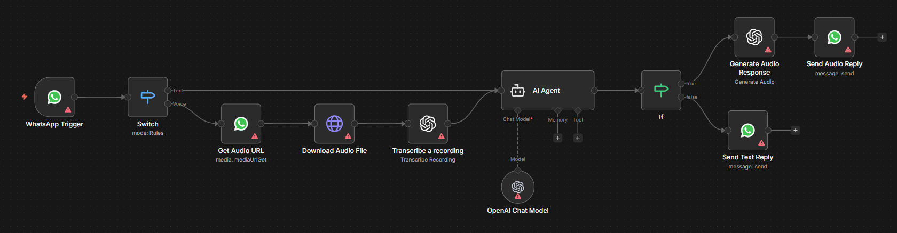

# WhatsApp AI Assistant

## Use Case
A conversational WhatsApp bot that answers customer messages around the clock. The workflow accepts both text and voice inputs: text goes straight to an AI agent, while voice notes are downloaded, transcribed, and answered with a generated audio reply, delivering a natural voice-to-voice experience.

## Tools & Integrations
- WhatsApp Business Cloud API (Trigger, Send)
- OpenAI Chat (`gpt-4.1-nano`) via LangChain Agent
- OpenAI Audio (Whisper transcription + Text-to-Speech)
- HTTP Request (for media download)
- n8n core: Switch, IF

## Setup Instructions
1. In n8n, choose **Import from File** and upload `workflow.json` from this folder.
2. Configure credentials:
   - **WhatsApp Business Cloud API** for the trigger and the two send nodes.
   - **OpenAI API** for the chat model, transcription, and audio generation nodes.
3. Replace the hard-coded `phoneNumberId` (`1026730023853632`) on both `Send Audio Reply` and `Send Text Reply` with your own WhatsApp Business phone number ID.
4. Activate the workflow and send a test message to your registered WhatsApp number.

## Architecture

## Author
Rayan DJEBAR
